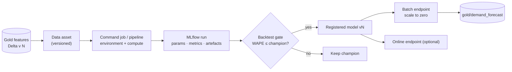

# Azure ML Lifecycle (design, Modules 5-6)

```mermaid
flowchart LR
  gold[("Gold features<br/>Delta v N")] --> asset["Data asset<br/>(versioned)"]
  asset --> job["Command job / pipeline<br/>environment + compute"]
  job --> mlflow["MLflow run<br/>params · metrics · artefacts"]
  mlflow --> eval{"Backtest gate<br/>WAPE ≤ champion?"}
  eval -- yes --> reg["Registered model vN"]
  eval -- no --> stop["Keep champion"]
  reg --> be["Batch endpoint<br/>scale to zero"]
  reg --> oe["Online endpoint (optional)"]
  be --> fc[("gold/demand_forecast")]
```

Status: **planned**. See the [Modules 5-6 roadmap](../docs/azure-machine-learning/README.md).
