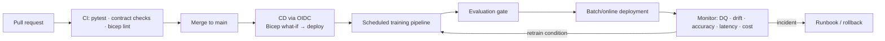

# MLOps Workflow (design, Module 7)

```mermaid
flowchart LR
  pr["Pull request"] --> ci["CI: pytest · contract checks · bicep lint"]
  ci --> merge["Merge to main"]
  merge --> cd["CD via OIDC<br/>Bicep what-if → deploy"]
  cd --> sched["Scheduled training pipeline"]
  sched --> gate["Evaluation gate"]
  gate --> deploy["Batch/online deployment"]
  deploy --> mon["Monitor: DQ · drift · accuracy · latency · cost"]
  mon -->|"retrain condition"| sched
  mon -->|"incident"| runbook["Runbook / rollback"]
```

Status: **planned**. See the [Module 7 roadmap](../docs/mlops/README.md).
